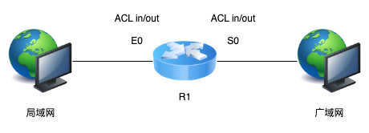
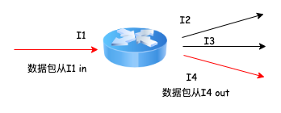
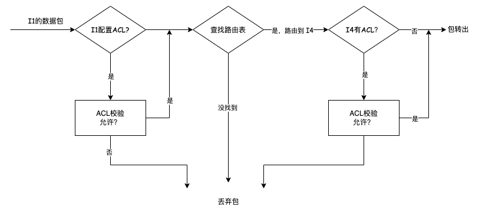
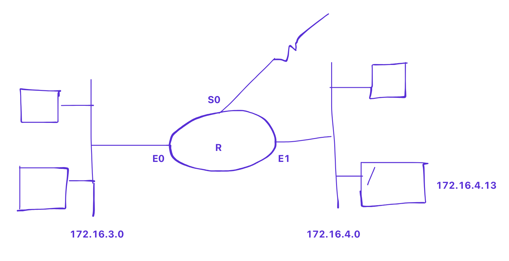
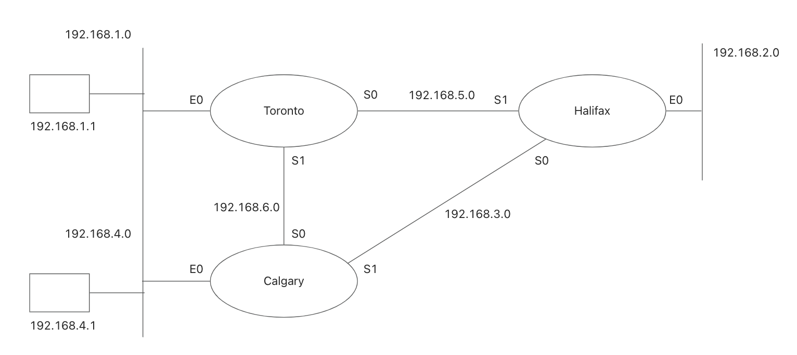

# 手写访问控制列表（ACL）


## 前言

本文先介绍了访问控制列表的基本概念，然后分别通过标准 ACL （Standard ACL）和拓展 ACL （Extend ACL）的示例让大家学会手写 ACL，由此深入理解路由器内部原理。不同的路由器内部的 ACL 规则可能有些偏差，本文以思科（Cisco）路由器为例。可能华为毕竟作为了国内 4G，5G 通信建设的重要角色，所以国内关于 ACL 的介绍更多和华为相关。

## 基本概念

访问控制列表（Access Control Lists，ACL）是应用在路由器接口的指令列表[1]。有了它，通过在路由器内配置 ACL，我们可以限制或允许某些 ip 地址段的数据包进入路由器，或从路由器转出。



假设 R1 是路由器，E0 和 S0 是路由器的两个接口：

- 数据包从局域网到广域网，E0 是 ACL 的 in 方向，S0 是 ACL 的 out 方向
- 数据包从广域网到局域网，E0 是 ACL 的 out 方向，S0 是 ACL 的 in 方向

对于如下路由器：



内部路由规则：



## 示例1 ：手写 ACL

### 标准 ACL

- 每条语句都校验 IP 数据包的源地址
- 根据校验结果决定允许/拒绝数据包

如何手写标准 ACL：

- 编写允许/拒绝策略
- 编写路由器接口
- 将策略绑定到该接口

```
access-list acl-number {permit/deny} source[mask]
access-list acl-number {permit/deny} source[mask]
interface interface-number
ip access-group acl-number {in/out}
```

mask 表示掩码，用于指定基于 source 的 ip 范围，0 表示相应的位必须匹配，1 表示不匹配

示例 1: 拒绝来自 172.16.3.14 的数据包

```
access-list 1 deny 172.16.3.14 0.0.0.0
                    |__________| | | |
                        |________| | |
                          |________| |
                            |________|   
``` 

示例 2: 允许所有来自 172.16.0.0 的数据包

```
access-list  2  permit  172.16.0.0   0.0.255.255
```



1. 仅允许网络 172.16.3.0 和 172.16.4.0 上的 172.16.0.0 流量。（拒绝 3.0 和 4.0 上的非 172.16.0.0 网络流量）

```
access-list 1 permit 172.12.0.0 0.0.255.255
interface E0
ip access-group 1 out
interface E1
ip access-group 1 out
```

为什么不绑定在 in 方向？
- 如果一个新的网络（例如 172.16.5.0）加入，ACL 需要更改
- 数据包进入路由器前会被丢弃

2. 在 172.16.3.0 上拒绝 172.16.4.13 的流量，在 172.16.3.0 上也只允许 172.16.0.0 的流量

```
access-list  2  deny    172.16.4.13  0.0.0.0
access-list  2  permit  172.16.0.0   0.0.255.255
interface E0
ip access-group 2 out
```

3. 在 172.16.3.0 上，拒绝 172.16.4.0 的流量，允许所有其他来自 172.16.0.0 的流量


```
access-list  3  deny    172.16.4.0   0.0.0.255
access-list  3  permit  172.16.0.0   0.0.255.255
interface E0
ip access-group 3 out
```

### 拓展 ACL

- 每条语句都会检查IP数据包的源地址、目的地地址，以及可能的协议（如tcp）和端口号（如21-ftp）
- 结果根据源地址、目的地地址、协议和端口号的组合决定允许/拒绝数据包

如何手写拓展 ACL：

```
access-list acl-number {permit/deny} protocol source source-mask  destination  destination-mask [eq port number]
access-list acl-number {permit/deny} protocol source source- mask destination destination-mask [eq port number]
interface      interface-number
ip access-group acl-number {in/out}
```

- acl-number: 100~199
- protocol: tcp, udp, icmp, igmp, ip

4. 拒绝 172.16.3.0 上的 FTP 访问，拒绝 3.0 上的非 172.16.0.0 的流量

```
access-list  101  deny    tcp  172.16.0.0  0.0.255.255  172.16.3.0  0.0.0.255  eq 20
access-list  101  deny    tcp  172.16.0.0  0.0.255.255  172.16.3.0  0.0.0.255  eq 21
access-list  101  permit  ip   172.16.0.0  0.0.255.255  172.16.3.0  0.0.0.255
interface E0
ip access-group 101 out
```

其中前两行可合并为一行：
```
access-list  101  deny    tcp  172.16.0.0  0.0.255.255  172.16.3.0  0.0.0.255  range 20-21
```

5. 在 172.16.3.0 上拒绝来自 172.16.4.13 的 SSH 流量，在 172.16.3.0 上拒绝非 172.16.0.0 的流量

```
access-list  102  deny    tcp  172.16.4.13  0.0.0.0      172.16.3.0   0.0.0.255  eq 22
access-list  102  permit  ip   172.16.0.0   0.0.255.255  172.16.3.0   0.0.0.255
interface E0
ip access-group 102 out
```

### 示例 2



#1: 阻止从 192.168.2.0 到 192.168.1.0 的流量（必须允许所有其他流量）

```
access-list  1  deny    192.168.2.0  0.0.0.255
access-list  1  permit  any
Toronto # interface E0
ip access-group 1 out
```

#2: 阻止从 192.168.4.1 到 192.168.2.0 的流量（必须允许所有其他流量）

```
access-list  2   deny   192.168.4.1  0.0.0.0
access-list  2   permit any
Halifax # interface E0
ip access-group 2 out
```

#3: 来自 192.168.4.0 的流量必须不能经过 192.168.3.0

```
access-list 3 deny   192.168.4.0  0.0.0.255
access-list 3 permit any
Calgary # interface S1
ip access-group 3 out
Halifax # interface S0
ip access-group 3 out
```

#4: 阻止所有从 192.168.4.1 到 192.168.1.1 的 SSH 流量（必须允许所有其他流量）

```
access-list 101 deny   tcp  192.168.4.1  0.0.0.0  192.168.1.1  0.0.0.0 eq 22
access-list 101 permit ip   any          any
Calgary # interface E0
ip access-group 101 in
```

#5: 阻止所有从 192.168.1.1 到 192.168.2.0 的 FTP 流量（必须允许所有其他流量）

```
access-list 102  deny   tcp  192.168.1.1  0.0.0.0  192.168.2.0  0.0.0.255 range 20-21
access-list 102  permit ip  any any
Toronto # interface E0
ip access-group 102 in
```

#6: 允许从 192.168.1.1 到 192.168.4.1 的 SNMP 流量，允许从 192.168.4.1 到 192.168.1.1 的 HTTP 流量，之间不允许其他的流量（SNMP 端口 161，HTTP 端口 80）

```
access-list 103 permit udp 192.168.1.1 0.0.0.0   192.168.4.1 0.0.0.0   eq 161
access-list 103 permit tcp 192.168.4.1 0.0.0.0   192.168.1.1 0.0.0.0   eq 80
access-list 103 deny   ip  192.168.1.0 0.0.0.255 192.168.4.0 0.0.0.255
access-list 103 deny   ip  192.168.4.0 0.0.0.255 192.168.1.0 0.0.0.255
access-list 103 permit ip  any         any
Toronto # interface E0
ip access-group 103 in
Calgary # interface E0
ip access-group 103 in

```

## 参考文章

[1] [访问控制列表](https://baike.baidu.com/item/%E8%AE%BF%E9%97%AE%E6%8E%A7%E5%88%B6%E5%88%97%E8%A1%A8/1844390?fr=ge_ala)
