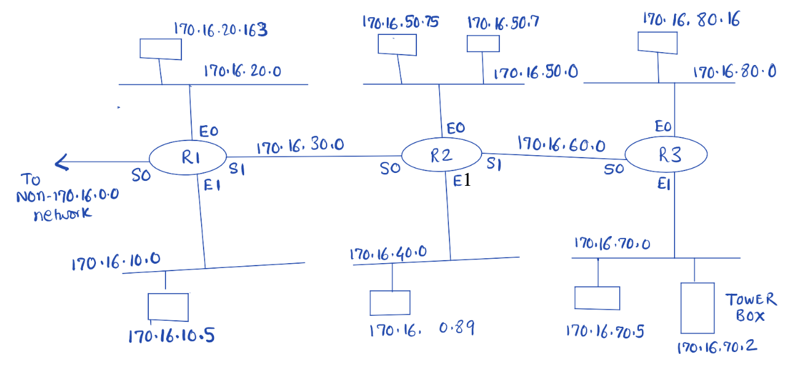

# ACLs 访问控制权限

## 示例

**示例 1**


1. Allow only 172.16.0.0 traffic on the networks 172.16.3.0 and 172.16.4.0. (Deny non 172.16.0.0 network traffic on 3.0 and 4.0)

```
access-list 1 permit 172.12.0.0 0.0.255.255
interface E0
ip access-group 1 out
interface E1
ip access-group 1 out
```

2.

```
access-list  2  deny    172.16.4.13  0.0.0.0
access-list  2  permit  172.16.0.0   0.0.255.255
interface E0
ip access-group 2 out
```

3. Deny traffic from 172.16.4.0 on 172.16.3.0 Allow all other 172.16.0.0 traffic

```
access-list  3  deny    172.16.4.13  0.0.0.255
access-list  3  permit  172.16.0.0   0.0.255.255
interface E0
ip access-group 3 out
```


4. Deny FTP access on 172.16.3.0. Deny non 172.16.0.0 traffic on 3.0

```
access-list  101  deny    tcp  172.16.0.0  0.0.255.255  172.16.3.0  0.0.0.255  eq 20
access-list  101  deny    tcp  172.16.0.0  0.0.255.255  172.16.3.0  0.0.0.255  eq 21
access-list  101  permit  ip   172.16.0.0  0.0.255.255  172.16.3.0  0.0.0.255
interface E0
ip access-group 101 out
```

其中前两行可合并为一行：
```
access-list  101  deny    tcp  172.16.0.0  0.0.255.255  172.16.3.0  0.0.0.255  range 20-21
```

5. Deny SSH from 172.16.4.13 on 172.16.3.0, Deny non 172.16.0.0 traffic on 172.16.3.0

```
access-list  102  deny    tcp  172.16.4.13  0.0.0.0      172.16.3.0   0.0.0.255  eq 22
access-list  102  permit  ip   172.16.0.0   0.0.255.255  172.16.3.0   0.0.0.255
interface E0
ip access-group 102 out
```

**示例 2**

Specification #1: Prevent traffic from 192.168.2.0 to 192.168.1.0. (All other traffic must be permitted).

```
access-list  1  deny    192.168.2.0  0.0.0.255
access-list  1  permit  any
Toronto # interface E0
ip access-group 1 out
```

Specification #2: Prevent traffic from 192.168.4.1 to 192.168.2.0 (All other traffic must be permitted).

```
access-list  2   deny   192.168.4.1  0.0.0.0
access-list  2   permit any
Halifax # interface E0
ip access-group 2 out
```

Specification #3: Traffic originating from the network 192.168.4.0 must not flow on
192.168.3.0.

```
access-list 3 deny   192.168.4.0  0.0.0.255
access-list 3 permit any
Calgary # interface S1
ip access-group 3 out
Halifax # interface S0
ip access-group 3 out
```

Specification #4: Prevent SSH traffic from 192.168.4.1 to 192.168.1.1 (All other traffic must be permitted).

```
access-list 101 deny   tcp  192.168.4.1  0.0.0.0  192.168.1.1  0.0.0.0 eq 22
access-list 101 permit ip   any          any
Calgary # interface E0
ip access-group 101 in
```

Specification #5: Prevent FTP traffic from 192.168.1.1 to 192.168.2.0 (All other
traffic must be permitted).


```
access-list 102  deny   tcp  192.168.1.1  0.0.0.0  192.168.2.0  0.0.0.255 range 20-21
access-list 102  permit ip  any any
Toronto # interface E0
ip access-group 102 in
```

Specification #6: Allow SNMP from 192.168.1.1 to 192.168.4.1 and allow HTTP access from 192.168.4.1 to 192.168.1.1. No other traffic should flow between the two networks. (Note: SNMP is 161 and HTTP is 80).

```
access-list 103 permit udp 192.168.1.1 0.0.0.0   192.168.4.1 0.0.0.0   eq 161
access-list 103 permit tcp 192.168.4.1 0.0.0.0   192.168.1.1 0.0.0.0   eq 80
access-list 103 deny   ip  192.168.1.0 0.0.0.255 192.168.4.0 0.0.0.255
access-list 103 deny   ip  192.168.4.0 0.0.0.255 192.168.1.0 0.0.0.255
access-list 103 permit ip  any         any
Toronto # interface E0
ip access-group 103 in
Calgary # interface E0
ip access-group 103 in

```

**示例 3**



Specifications:

a) Traffic from the network 170.16.40.0 must not be allowed on the 170.16.50.0 network. All other traffic must be allowed on 170.16.50.0 as long as it originates from 170.16.0.0 (that is, outside traffic must not be allowed).

```
access-list 1 deny   170.16.40.0 0.0.0.255
access-list 1 permit 170.16.0.0  0.0.255.255
R2 # interface E0
ip access-group 1 out
```

b) Prevent all traffic from the workstation 170.16.10.5 from reaching the workstation 170.16.80.16. Traffic from all other hosts/ networks including traffic from outside should be allowed everywhere.

```
access-list 2 deny   170.16.10.5 0.0.0.0
access-list 2 permit any
R3 # interface E0
ip access-group 2 out
```

c) Workstations 170.16.50.75 and 170.16.50.7 should not be allowed HTTP access to the tower box 170.16.70.2. All other workstations can have HTTP access on the tower box. All other traffic including traffic from outside networks are allowed.

```
access-list 101 deny   tcp 170.16.50.75 0.0.0.0     170.16.70.2 0.0.0.0 eq 80
access-list 101 deny   tcp 170.16.50.7  0.0.0.0     170.16.70.2 0.0.0.0 eq 80
access-list 101 permit tcp 170.16.0.0   0.0.255.255 170.16.70.2 0.0.0.0 eq 80
access-list 101 permit ip  any          any
R3 # interface E1
ip access-group 101 out
```

d) 170.16.80.16 can telnet to 170.16.40.89. No one else from the network 170.16.80.0 can telnet to 170.16.40.89. Also permit all other traffic to 170.16.40.89, but only if they originate from 170.16.0.0 (that is, do not allow outside traffic).

```
access-list 102 permit tcp 170.16.80.16 0.0.0.0     170.16.40.0 0.0.0.255 eq 23
access-list 102 deny   tcp 170.16.80.0  0.0.0.255   170.16.40.0 0.0.0.255 eq 23
access-list 102 permit ip  170.16.0.0   0.0.255.255 170.16.40.0 0.0.0.255
R2 # interface E1
ip access-group 102 out
```


e) 170.16.10.5 can do only ftp access onto any host on the network 170.16.70.0. All other types of traffic from all other hosts are allowed, but only if they originate from 170.16.0.0 (that is, do not allow outside traffic).

```
access-list 103 permit tcp 170.16.10.5 0.0.0.0     170.16.70.0 0.0.0.255 range 20-21
access-list 103 permit ip  170.16.0.0  0.0.255.255 170.16.70.0 0.0.0.255
access-list 103 deny   ip  any         any
R3 # interface E1
ip access-group 103 out
```

f) Prevent traffic from the network 170.16.20.0 from flowing on the network 170.16.70.0 (that is, it must not flow on the network in either direction). All other traffic, including traffic from outside can.

```
access-list 3 deny   170.16.20.0 0.0.0.255
access-list 3 deny   170.16.70.0 0.0.0.255
access-list 3 permit any
R1 # interface E0
ip access-group 3 out
R3 # interface E1
ip access-group 3 out
```

g) Prevent traffic from the tower box 170.16.70.2 from going outside to the non-170.16.0.0 network. All other traffic can go out.

```
access-list 4 deny   170.16.70.2 0.0.0.0
access-list 4 permit any
R1 # interface S0
ip access-group 4 out
```
