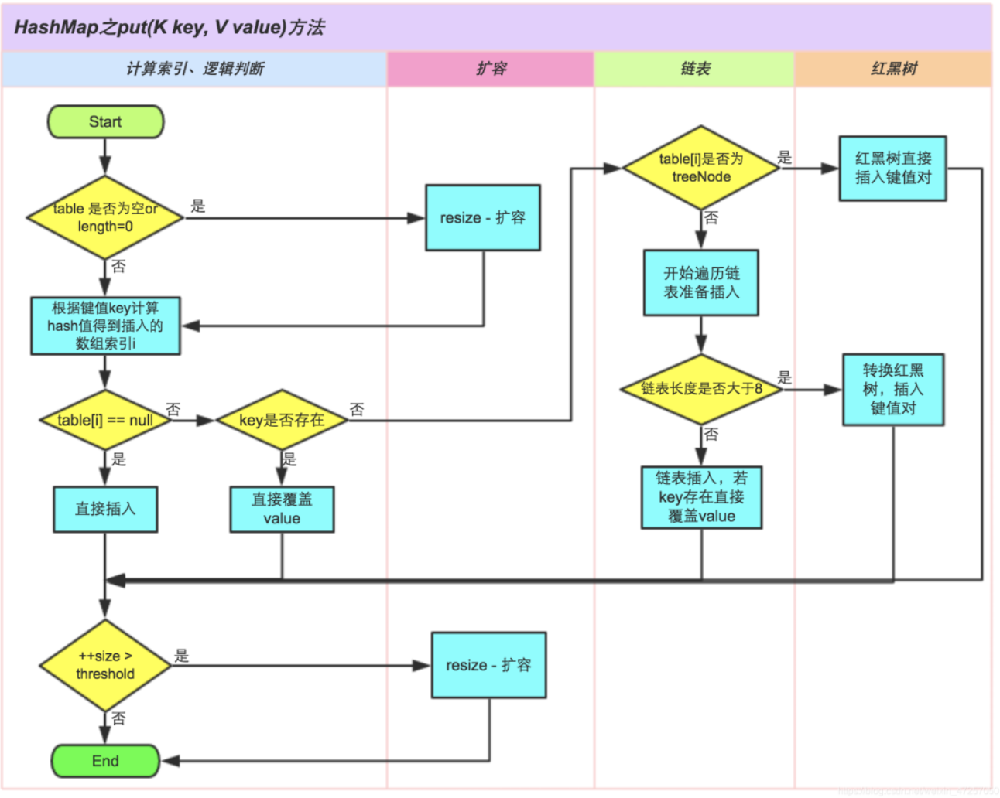
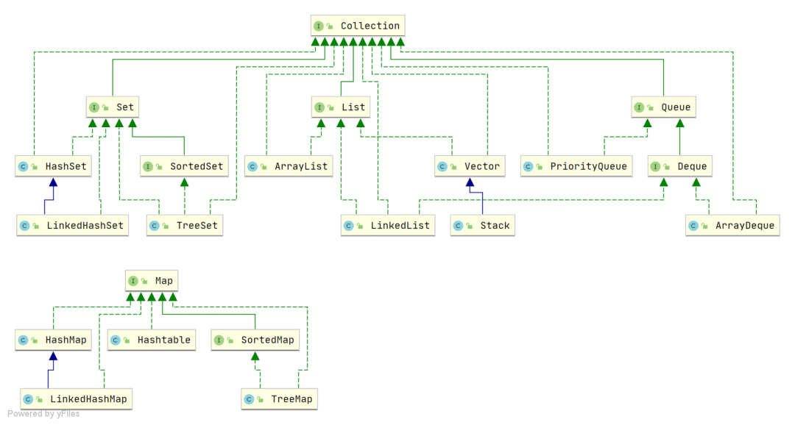

# Java 面试题-基础

## 基础

### 面向对象？多态？重载？

面向对象的三大特点：

- 封装：将对象的数据和方法结合在一起，对外隐藏内部实现细节，只对外暴露接口。封装的目的是增强安全性和简化编程，使对象更加独立。
- 继承：子类可以继承父类，从而共享父类的数据结构和方法，继承是代码复用的重要手段，也为多态建立基础。
- 多态：多态允许不同对象对同一消息多出响应。同一个接口使用不同的实例可以执行不同的操作。具体有重载和重写。重载是方法名相同，参数不同。重写是子类继承父类，子类可以重新实现父类的方法。

多态是指同一个方法名在不同的对象上可以有不同的行为。可通过继承和接口实现：

- 子类继承父类，可重写父类的方法
- 不同的类可以实现相同的接口

### 重载和重写的区别是什么？

- 重载方法名相同，参数列表不同（参数的类型，数量，顺序），返回值可能也不同
- 重写是子类继承父类，子类重新实现父类的方法，方法名和参数列表均相同

实现一个常用的多态的例子：

```
public class Animal {
    public void say() {
        System.out.println("dddd");
    }

    public static void main(String[] args) {
        Dog dog = new Dog();
        dog.say();

        Pig pig = new Pig();
        pig.say();

        Bird bird = new Bird();
        bird.say();
    }
}

class Dog extends Animal {
    public void say() {
        System.out.println("汪");
    }
}

class Pig extends Animal {
    public void say() {
        System.out.println("哼");
    }
}

class Bird extends Animal {
    public void say() {
        System.out.println("叽喳");
    }
}
```

如上例子实现了一个 `Animal` 类，`Dog`, `Pig`, `Bird` 类分别继承了 `Animal` 类，并重写了 `say()` 方法，这样实例化不同的类，调用同一个方法 `say()` 时，会打印不同的叫声。

### Java 中的设计模式？介绍下常用的一些？

- 单例模式：确保一个类只有一个实例，并提供一个全局访问点
- 工厂方法模式：定义一个创建对象的接口，但让实现这个接口的类来决定实例化哪个类
- 抽象工厂模式；提供一个接口，用于创建相关或依赖对象的家族，而不需要指明具体类

## JVM

### JVM 内存模型说一下

- 堆（Heap）：堆是 Java 虚拟机中最大的一块内存区域，用于存储各种类型的对象示例，也是垃圾收集器的主要工作区域，Java 堆根据对象存活时间的不同，Java 堆还被分为年轻代、老年代两个区域，年轻代进一步划分为 Eden 区，From Survivor 0、To Survivor 1 区
- 方法区（Method Area）：方法区也是所有线程共享的部分，它用于存储类的加载信息、静态变量、常量池、方法字节码等数据。在 Java 8 以前被实现为永久代（Permanent Generation），在 Java 8 中被改为元空间（Metaspace）
- 虚拟机栈（VM Stack）：每个线程都有一个虚拟机栈。虚拟机栈保存着方法执行期间的局部变量、操作数栈、方法出口等信息。线程每调用一个 Java 方法时，会创建一个栈帧（Stack Frame），栈帧包含着该方法的局部变量、操作数栈、方法返回地址等信息。栈帧在方法执行结束后会被弹出
- 程序计数器（Program Counter Register）：每个线程都有一个程序计数器。当线程执行 Java 方法时，程序计数器保存当前指令的地址，以便在 JVM 调用其他方法或恢复线程执行时，重新回到正确的位置
- 本地方法栈（Native Method Stack）：与 Java 虚拟机类似，但是为本地方法服务

### 哪些地方会发生垃圾回收？

- 堆内存：垃圾回收主要针对堆内存中不再被引用的对象进行回收，包括新生代和老年代中的对象
- 永久代/元空间：虚拟机中存放类的元数据信息的区域，也会进行垃圾回收，即对不再使用的类信息进行清理
- 字符串常量池：存放字符串常量的区域，也会进行垃圾回收，对不再被引用的字符串进行清理

## HashMap

### HashMap 的数据结构是什么？

- JDK1.7 及之前版本采用数组+链表的方式， JDK1.8 开始采用数组+链表/红黑树的方式
- 链表长度大于 8 会改变成红黑树，小于 6 时会从红黑树退化为链表

### HashMap 的扩容机制？

- 判断老表容量是否超过上限，是修改为 Integer.MAX_VALUE
- 否将容量和阈值都修改为原来 2 倍，遍历老数组，如果索引位置有一个节点，直接迁移到新位置，如果大于 1 个，则判断是红黑树节点还是链表节点，如果是链表，先保存头结点，然后依次计算后续的节点
- Jdk1.8 之前头插法，1.8 开始尾插法

### HashMap 是线程安全的吗？

线程不安全。

- JDK1.7 采用数据+链表，多线程下，扩容时存在 Entry 链死循环和数据丢失问题。
- JDK1.8`resize()` 时，旧数据还没有被转移到重新哈希后的位置，但这时请求的 `key` 已经会被定位到重新哈希后的位置，导致获取到空值，这条暂时不确定
- 多线程 `put` 时可能会数据覆盖。如果两个不同的 key 发生哈希冲突，可能会只新增一个列表节点而不是两个

### HashTable 和 ConcurrentHashMap 的区别是什么？

- HashTable 在整个方法加锁，ConcurrentHashMap 在每个链表头节点加锁，不会发生锁冲突
- HashTable 使用 `synchronized` 加锁，ConcurrentHashMap 使用 CAS，后者效率更高
- HashTable `resize` 时旧元素搬到新空间，然后释放旧空间，大量拷贝，效率低；ConcurrentHashMap 每次拷贝一部分，新旧空间同时存在
- HashTable `get` 加锁，ConcurrentHashMap `get` 不加锁，原因是 Node 中的 val(和 next) 使用 volatile 修饰

### 为什么引入红黑树，不引入其他树？

红黑树相比于其他树，性能和稳定性更好，具体来说：

1. 为什么不用二叉排序树？二叉排序树在极端条件下可能出现线性结构，比如每次添加的元素均小于或大于当前所有元素，则该树变为线性结构。这时查询的效率和链表一样，所以不用二叉排序树
2. 为什么不用平衡二叉树（AVL 树）？AVL 树是严格平衡的二叉树，而红黑树是基于 2-3 树演变而来，没有严格平衡，因此 AVL 树为了保持平衡进行的旋转次数要多于红黑树，性能也就不如红黑树

### HashMap 出现红黑树会一直增高变成无限高的情况吗？

不会。集合中节点的数量超过阈值，HashMap 会进行扩容，原始红黑树的节点会被打散，可能会退款成链表结构。

### HashMap 读和写的时间复杂度是多少？

读、写（插入、更新、删除）的时间复杂度均为 O(1)。使用键值对存储数据，可直接计算出哈希值来定位到对应的存储位置。

### 怎么解决 HashMap 线程不安全的问题？

- 使用 `ConcurrentHashMap`：ConcurrentHashMap 是线程安全的哈希表实现，通过分段锁和 CAS 保证线程安全
- 使用 `Collections.synchronizedMap`：该方法会返回同步 Map 对象，但性能不如 ConcurrentHashMap

### HashMap put 的流程？



### 拓展：解决线程安全问题还有哪些办法？

- 使用同步关键字 `synchronized`：同一时刻只有一个线程可以访问共享资源
- 使用 `volatile` 关键字：一个线程修改了共享变量的值，其他线程可以立即看到该值
- 使用线程安全的工具类：如 `AtomicInteger`,`AutomicLong`,`CountDownLatch` 等线程安全的工具类
- 使用多线程并发容器：如 `ConcurrentLinkedQueue`, `CopyOnWriteArrayList` 等

### HashMap 的 put 流程？

1. 计算 key 的 Hash 值，即 key 要添加的数组的位置
2. 检查该位置是否为空
	- 如果为空，则创建一个新的 Node 来保存键值对，并保存在数组的对应位置。modCount 加 1，以便在迭代时发现并发修改
3. 如果在该位置已经存在其他键值对，检查该位置的第一个键值对的哈希码是否与要添加的键值对相同
	- 如果相同，则表示找到了相同的键，直接将新的值替换旧的值，完成更新操作
4. 如果第一个键值对的哈希码和键不相同，则需要遍历链表或红黑树来查找是否有相同的键
	- 如果键值对集合是链表结构：
		- 从链表的头部开始逐个比较键的哈希码和 `equals()` 方法，知道找到相同的键或达到链表末尾
		- 如果找到了相同的键，则使用新的值取代旧值，即更新键对应的值
		- 如果没有找到相同的键，则将新的键值对添加到链表的头部
	- 如果键值对是红黑树结构：
		- 在红黑树中使用哈希码和 `equals()` 方法进行查找，根据键的哈希码，定位到红黑树中的某个节点，然后逐个比较键，知道找到相同的键或达到红黑树末尾
		- 如果找到了相同的键，则使用新值代替旧值，更新对应的值
		- 如果没有找到相同的键，则将新的键值添加到红黑树中
5. 检查链表长度是否为 8
	- 如果链表长度超过阈值，且 HashMap 的数组长度大于 64，则会将链表转为红黑树
6. 检查负载因子是否大于 0.75
	- 如果键值对的数量/数组长度 > 阈值，则需要进行扩容操作
7. 扩容
	- 创建一个新的两倍大小的数组
	- 将旧数组中的键值对重新计算哈希码并分配到新数组中的位置
	- 更新 HashMap 的数组引用和阈值参数
8. 完成添加操作

这里，HashMap 的键和值都可以为 null，是非线程安全的。

## Java 并发

### volatile 关键字底层是怎么实现的？如何保证内存可见性？

volatile 通过以下两种机制保证内存可见性：

- 禁止指令重排：在程序执行时，为了提高性能，编译器和处理器可能会指令重排序，导致变更的更新操作被延迟执行或乱序执行，其他线程无法看到最新的值。使用 volatile 关键字修饰的变量会禁止指令重排序，保证变量更新操作按照代码顺序执行。
- 内存屏障：在多核处理器架构下，每个线程都有自己的缓存，volatile 关键字会在写操作后插入写屏障（Write Barrier），在读操作前插入读屏障（Read Barrier），确保变量的更新能够立即被其他线程看到，保证内存的可见性。

通过指令重排序和插入内存屏障，volatile 关键字能够保证被修饰变量的更新操作对其他线程是可见的，从而有效解决了多线程环境下的内存可见性问题。

### 为什么需要保证内存可见性

为了解决数据一致性。如果不保证内存可见性，一个线程改变了共享变量的值，另一个线程无法看到最新的值，没有使用最新的数据，导致产生错误的结果。

### volatile 为什么要禁止指令重拍，能举一个具体的指令重拍出现的例子吗？

禁止指令重拍是为了保证程序的执行顺序和编写的顺序一致，特别是在多线程环境下，避免出现意外的结果。

如:

```
int a = 0;
boolean flag = false;

a = 1; 
flag = false;

if (flag) {
    System.out.println(a);
}
```

如果发生指令重排，可能发生在判断 flag 先于 `a` 的赋值操作，从而打印出 `0`。如果禁止指令重排，则在多线程环境下保证代码按顺序执行，保证 `System.out.println(a);` 可以输出 1。

### Synchronized 的底层原理是什么，锁升级的过程了解吗？

- Synchronized 底层使用 monitor 对象锁实现，每一个对象关联一个 monitor 对象，而 monitor 对象锁是互斥的，同一个时刻只能有一个线程持有对象锁，其他线程想再获取对象锁时会被阻塞住，这样就能保证拥有对象锁的线程可以安全执行临界区的代码
- 锁升级是指 jvm 根据锁的竞争对象和对象的状态，将对象的锁从偏向锁、轻量锁升级为重量级锁的过程。
    - 偏向锁是指针对无竞争的情况下，锁会偏向于第一个获取锁的线程
    - 轻量锁是指段时间内只有一个线程竞争锁的情况下，使用 CAS 操作来避免阻塞
    - 重量级锁是指多个线程竞争同一个锁时，通过操作系统的互斥量来实现线程阻塞和唤醒。
    - 锁升级为了提供多线程并发访问的效率和性能

### 线程是怎么拿到锁的？

检查锁的状态，并尝试获取锁。在 JVM 中，锁信息具体是存放在 Java 对象头中的。

当一个线程尝试进入 synchronized 代码块或方法时，JVM 会检查对应对象的锁状态。如果一个对象的锁未被其他线程持有，即锁状态为可获取，那么该线程将成功获取锁并进入临界区执行代码。

### 锁信息具体是放在哪里的？

锁状态信息是 Java 对象头中的 Mark Word 字段，保存了锁的信息、垃圾回收信息等。Java 对象在内存中有如下字段：

- 对象头
    - Mark Word
    - Class Pointer
    - Length
- 对象实际数据
    - Instance Data/Array Data
- 对齐填充
    - Padding

JVM 通过操作对象的头部信息来实现锁的获取、释放以及等待队列的管理。当线程成功获取锁后，对象的头部信息会被更新为当前线程的标识，表示该线程拥有了这个锁。

其他线程在尝试获取同一个锁时，会检查对象的头部信息，如果锁已经被其他线程持有，他们将会被阻塞直到锁被释放。

### Synchronized 锁和 ReentrantLock 加锁有什么区别？

- 用法不同：synchronized 可用来修饰普通方法、静态方法和代码块，而 ReentrantLock 只能用在代码块上
- 获取锁和释放锁的方式不同：synchronized 会自动加锁和释放锁，当进入 synchronized 修饰的代码块之后会自动加锁，当离开 synchronized 的代码段之后会自动释放锁。ReentrantLock 需要手动加锁和释放锁
- 锁类型不同：synchronized 属于非公平锁，而 ReentrantLock 既可以是公平锁也可以是非公平锁
- 响应中断不同：ReentrantLock 可以响应中断，synchronized 不可以
- 底层实现不同：synchronized 是 JVM 层面通过监视器实现的，ReentrantLock 是基于 AQS 实现的

### sleep 和 wait 的区别是什么？

- 相同点：`sleep` 和 `wait` 都会暂停当前线程并让出 cpu
- 不同点：
  - 定义位置不同，`sleep` 是 Thread 的方法，`wait` 是 Object 的方法
  - 调用位置不同：`sleep` 可以在任何地方使用，`wait` 只能在同步方法或同步块中使用
  - 锁资源释放方式不同：`sleep` 只是让出了 CPU，但没有释放同步资源锁，`wait` 让当前线程退出同步资源锁，其他线程调用 `notify` 时才会继续竞争同步资源锁，从而执行
  - 恢复方式不同：`sleep` 调用停止后仍持有同步锁，所以到时间后会继续执行，`wait` 调用会放弃对象锁，进入等待队列，待调用 notify/notifyAll唤醒指定的线程或所有线程，才会进入锁池，等到再次获取到对象锁时才会进入运行状态，在没有获取到对象锁之前不会运行
  - 异常捕获：`sleep` 需要捕获或抛出异常，wait/notify/notifyAll 则不需要

### 为什么wait要包在同步块？

Java 中的 wait() 方法需要在同步块（synchronized block）中调用的原因是因为 wait()方法会释放对象的锁，而在同步块中可以确保线程在调用 wait() 方法前持有对象的锁，从而避免多线程执行时的竞争和冲突。

具体原因如下：

- 线程安全：在同步块中调用 wait() 方法可以确保线程在调用 wait() 前已经获取了对象的锁，避免多线程之间的竞争和数据不一致性问题。
- 对象监视器：wait() 方法会释放对象的监视器（monitor），其他线程可以获取该对象的监视器并执行同步操作，确保线程之间的协作和同步。
- 唤醒机制：当调用 wait() 方法后，线程会进入等待状态，只有在其他线程调用 notify() 或 notifyAll() 方法唤醒该线程时，线程才会继续执行。在同步块中调用 wait() 可以保证线程被正确唤醒。

### 创建线程有哪些方式？

1. 继承 Thread 类并重写 `run()` 方法
2. 实现 `Runnable` 接口并实现 `run()` 方法
3. 使用 Callable 和 Feature 接口通过 Executor 框架创建线程

对于第 3 点：

```java

import java.util.concurrent.Callable;
import java.util.concurrent.FutureTask;

public class CreateThreadCallableFutureTask {
    public static final int MAX_TURN = 5;
    public static final int COMPUTE_TIMES = 100000000;
    static class ReturnableTask implements Callable<Long> {
        @Override
        public Long call() throws Exception {
            long startTime = System.currentTimeMillis();
            System.out.println(Thread.currentThread().getName() + " 线程运行开始。");
            Thread.sleep(1000);

            for (int i = 0; i < COMPUTE_TIMES; i++) {
                int j = i * 10000;
            }
            long used = System.currentTimeMillis() - startTime;
            System.out.println(Thread.currentThread().getName() + "线程运行结束。");
            return used;
        }
    }

    public static void main(String[] args) throws InterruptedException {
        ReturnableTask task = new ReturnableTask();
        FutureTask<Long> futureTask = new FutureTask<>(task);

        Thread thread = new Thread(futureTask, "returnableThread");
        thread.start();
        Thread.sleep(500);
        System.out.println(Thread.currentThread().getName() + " let 子弹 fly a moument");
        System.out.println(Thread.currentThread().getName() + " 做自己的事情：");

        for (int i = 0; i < COMPUTE_TIMES /2; i++) {
            int j = i * 10000;
        }
        System.out.println(Thread.currentThread().getName() + " 获取并发任务的执行结果");
        try {
            System.out.println(Thread.currentThread().getName() + "线程占用时间" + futureTask.get());
        } catch (Exception e) {
            e.printStackTrace();
        }
        System.out.println(Thread.currentThread().getName() + "运行结束。");
    }
}
```

### 线程有哪些状态？

|线程状态|解释|
|:-|:-|
|NEW|尚未启动线程的状态，即创建线程但为调用 start() 方法|
|RUNNABLE|就绪状态，调用 start() 等待运行 + 正在运行|
|BLOCKED|等待监视器锁时，进入阻塞状态|
|WAITING|该线程正在等待另一个线程完成特定操作（notify,notifyAll）|
|TIMED_WAITING|具有等待时间的等待状态|
|TERMINATED|线程完成执行，进入终止状态|

### 如何保证线程安全？

- 使用同步代码块(synchronized)或同步方法来保护共享资源，确保同一时刻只有一个线程访问
- 使用线程安全的集合，如 ConcurrentHashMap、CopyOnWriteArrayList 等
- 使用 Lock 接口极其实现类（如 ReentrantLock）来进行线程同步
- 使用 TheadLocal 来保证每个线程都有自己的独立版本

### 公平锁和非公平锁是什么意思？

- 公平锁是指多个线程按照锁申请的顺序来获取锁，线程直接进入队列中排队，队列中的第一个线程才能获取到锁。公平锁的优点在于各个线程公平平等，但是吞吐量小
- 非公平锁是指多个线程加锁时直接抢占锁，抢到了就直接占有锁，抢不到才进入队列中排队。优点是吞吐量大，缺点是可能有的线程一直抢占不到锁，长时间不会运行

### ReentrantLock 如何实现公平锁和非公平锁？

默认使用非公平锁，参数传 true 时使用公平锁：

```
public ReentrantLock() {
    sync = new NonfairSync();
}

/**
 * Creates an instance of {@code ReentrantLock} with the
 * given fairness policy.
 *
 * @param fair {@code true} if this lock should use a fair ordering policy
 */
public ReentrantLock(boolean fair) {
    sync = fair ? new FairSync() : new NonfairSync();
}
```

公平锁的 Lock 方法：

```
static final class FairSync extends Sync {
    private static final long serialVersionUID = -3000897897090466540L;

    final void lock() {
        acquire(1);
    }

    /**
     * Fair version of tryAcquire.  Don't grant access unless
     * recursive call or no waiters or is first.
     */
    protected final boolean tryAcquire(int acquires) {
        final Thread current = Thread.currentThread();
        int c = getState();
        if (c == 0) {
            if (!hasQueuedPredecessors() && // 1
                    compareAndSetState(0, acquires)) {
                setExclusiveOwnerThread(current);
                return true;
            }
        }
        else if (current == getExclusiveOwnerThread()) {
            int nextc = c + acquires;
            if (nextc < 0)
                throw new Error("Maximum lock count exceeded");
            setState(nextc);
            return true;
        }
        return false;
    }
}
```

注释 1 处有个 `hasQueuedPredecessors()` 方法，表明当前队列没有前驱节点，即没有线程在等待时才会 `compareAndSetState`，这就实现了公平锁。

非公平锁的实现：

```
final void lock() {
    if (compareAndSetState(0, 1)) // 2
	setExclusiveOwnerThread(Thread.currentThread());
    else
	acquire(1);
}

final boolean nonfairTryAcquire(int acquires) {
    final Thread current = Thread.currentThread();
    int c = getState();
    if (c == 0) {
	if (compareAndSetState(0, acquires)) { // 3
	    setExclusiveOwnerThread(current);
	    return true;
	}
    }
    else if (current == getExclusiveOwnerThread()) {
	int nextc = c + acquires;
	if (nextc < 0) // overflow
	    throw new Error("Maximum lock count exceeded");
	setState(nextc);
	return true;
    }
    return false;
}
```

注释 2 处，在进入 `Lock()` 方法后会直接使用 CAS 尝试获取锁，在注释 3 处没有 `hasQueuedPredecessors()` 方法，直接使用 CAS 尝试获取锁，由此实现非公平锁。

## Java 线程池

### 线程池了解过吗？有哪些核心参数？

线程吃是为了减少频繁的创建线程和销毁线程带来的性能损耗。

线程池分为核心线程池，线程池的最大容量，还有等待任务的队列，提交一个任务，如果核心线程没有满，就创建一个线程，如果满了就加入等待队列，如果等待队列满了，就会增加线程，如果达到最大线程数量，就按照丢弃策略处理。

一共有 7 个参数：

```
public ThreadPoolExecutor(int corePoolSize,
                          int maximumPoolSize,
                          long keepAliveTime,
                          TimeUnit unit,
                          BlockingQueue<Runnable> workQueue,
                          ThreadFactory threadFactory,
                          RejectedExecutionHandler handler) 
```

- corePoolSize: 核心线程数。默认情况下，线程池中线程的数量 <= corePoolSize，即使线程处于空闲状态也不会被销毁
- maximumPoolSize: 最大线程数，即线程池中最多可以容纳的线程数量。
- keepAliveTime: 当线程池中线程的数量大于 corePoolSize，并且某个线程的空闲时间超过了 keepAliveTime，那么这个线程就会被销毁
- unit: keepAliveTime 的时间单位
- workQueue: 工作队列。当没有空闲的线程执行新任务时，该任务就会被放入工作队列
- threadFactory: 线程工厂。可以给线程取名字等
- handler: 拒绝策略。当一个新任务交给线程池，如果此时线程池中有空闲的线程，就会直接执行，如果没有空闲的的线程，就放入阻塞队列中，如果阻塞队列满了，就会创建一个新线程，从阻塞队列头部取出一个任务来执行，并将新任务加入到阻塞队列的末尾。如果当前线程池中线程的数量等于 maximumPoolSize，就不会创建新线程，就会去执行拒绝策略

### 为什么核心线程满了之后是先加入阻塞队列而不是直接加到总线程？

- 线程池创建线程需要获取 mainLock 这个全局锁，会影响并发效率，所以使用阻塞队列吧第一步创建核心线程与第三步创建最大线程隔离开来，起一个缓冲的作用
- 引入阻塞队列，是为了在执行 `execute()` 方法时，尽可能地避免获取全局锁

### 核心线程数一搬设置为多少？

假设机器有 N 个 CPU:

- 如果是 CPU 密集型应用，则线程池大小设置为 N+1，线程的应用场景：主要是复杂算法
- 如果是 IO 密集型应用，则线程池大小设置为 2N+1，线程的应用场景：数据库数据的交互，文件的上传下载，网络数据传输等

如果同时有计算工作和 IO 工作的任务，应该考虑使用两个线程池，一个处理计算任务，一个处理 IO 任务，分别对两个线程池按照计算密集型和 IO 密集型来设置线程数。

### IO 密集型线程数为什么设置为 2N+1？

在 IO 密集型任务中，线程通畅会因为 IO 操作而阻塞，此时可以让其他线程继续执行，充分利用 CPU 字段。设置为 2N+1 可以保证在有多个线程阻塞时，仍有足够的线程可以继续执行。

### String，StringBuilder，StringBuffer 区别？单线程大量操作字符串用哪个？

- String 是不可变字符序列，每次对 String 进行修改时都会创建一个新的 String 对象，因此在大量操作字符串时，使用 String 会频繁创建对象，导致性能较低
- StringBuilder 线程不安全，
- StringBuffer 线程安全，性能不如 StringBuilder，因为 StringBuffer 所有共有的方法都是同步的

因此单线程场景下，使用 StringBuilder 性能更好，多线程场景下使用 StringBuffer 能保证线程安全。

### synchronized 偏向锁直接升级为重量级锁吗？重量级锁是怎么实现的？

偏向锁不会直接升级为重量级锁，而是先升级为轻量级锁，如果轻量级锁竞争失败，则再升级为重量级锁。

重量级锁一般是通过操作系统的互斥量（mutex）来实现的，当一个线程获取重量级锁时，会将该线程挂起，直到锁被释放。这种锁的性能比较低，因为每次加锁和释放锁都需要涉及到操作系统的系统调用，开销比较大。因此在实际应用中，应尽量避免使用重量级锁。

## 类

### Java 中的异常分类？

- Checked Exception（受检异常）：这种异常在编译时就可以被检测出来，必须在代码中声明或者抛出，否则编译不通过。一般由外部环境引起，如 `IOException`，`SQLException` 等
- Unchecked Exception（非受检异常）：程序内部错误导致，这类代码不用显式声明抛出，抛出后不处理程序会崩溃，如 `NullPointerException`, `ArrayIndexOutOfBoundsException`, `IllegalArgumentException` 等
- Error（错误）：这类错误无法捕获，通常由 JVM 或内存不足引起。如 `OutOfMemory Error`, `StackOverFlowError` 等

Java 中，可以使用 `try ... catch` 捕获异常，使用 `throw` 手动抛出异常。

### 异常顶层是什么，有哪些接口实现类

- Throwable
  - Error
    - OutOfMemoryError
    - VirtualMachineError
    - StackOverFlowError
    - AssertionError
    - IOError
  - Exception
    - Checked Exception
      - IOException
      - ClassNotFoundException
      - SQLException
      - FileNotFoundException
    - Unchecked Exception
      - ArithmeticException
      - ClassCastException
      - IllegalThreadStateException
      - IndexOutOfBoundsException	

### 集合顶层是什么，各个接口实现类有哪些

集合的顶层有 Collection 和 Map，继承 Collection 的接口有 Set, SortedSet, List, Queue 和 Deque；继承 Map 的有 SortedMap

- Set：Set 的实现类有 HashSet、LinkedHashSet，SortedSet 继承 Set，实现 SortedSet 有 TreeSet
- List：List 的实现类有 ArrayList、LinkedList、Vector，Stack 继承 Vector，由于 Vector 不建议用，因此不建议用 Stack，最好是用 Deque 实现 Stack
- Queue：Queue 的实现类有 PriorityQueue，Deque 继承 Queue，Deque 的实现类有 ArrayDeque
- Map：Map 的实现类有 HashMap、HashTable，SortedMap 继承 Map，实现类有 TreeMap



### 有哪些集合是线程安全的？哪些集合是线程不安全的？

- Vector、HashTable、Properties 是线程安全的
- ArrayList、LinkedList、HashSet、TreeSet、HashMap、TreeMap 都是线程不安全的

### 数组和链表有什么区别？

- 访问效率：数组O(1)，链表O(n)
- 插入/删除效率：数据O(n)，链表O(1)
- 缓存命中率：数组在内存中连续存储，可以提高 CPU 缓存命中率，而链表节点不连续存储，可能导致 CPU 缓存命中率降低，频繁的缓存失效会影响性能
- 应用场景：数组适合静态大小，频繁访问元素的场景；链表适合动态大小，频繁插入、删除的场景

### 堆和栈的区别？

- 分配方式：堆是动态分配内存，由程序员手动申请和释放，通常用于存储动态数据结构和对象。栈是静态分配的内存，由编译器自动分配和释放内存，用于存储函数的局部变量和函数调用的信息
- 内存管理：堆需要手动管理内存的分配和释放，可能有内存泄露的问题。栈由编译器自动管理，遵循后进先出的原则，变量的生命周期由其作用域决定，函数调用时分配内存，函数返回时释放内存
- 大小和速度：堆内存空间通常比栈大，栈的速度大于堆

### Set 集合有什么特点？如何实现 key 是无重复的？

- Set 集合特点：Set 集合中的元素是无重复的，且唯一
- Set 原理：内部通过哈希表或红黑树来实现 key 的无重复，当向 Set 中插入元素时，会根据元素的 HashCode 值来确定元素的存储位置，然后再通过 equals 方法来判断是否存在相同的元素，如果存在则不会再次插入，保证了元素的唯一性

### 有序的 Set 是什么？记录插入顺序的集合是什么？

LinkedHashSet。 有序的 Set 是 TreeSet 和 LinkedHashSet。TreeSet 是基于红黑树实现，保证元素的自然顺序。LinkedHashSet 是基于双重链表和哈希表的结合来实现元素的有序存储，保证元素添加的顺序。

## 锁

### 乐观锁如何实现，有哪些缺点

乐观锁通过在更新数组时先检查数据版本号（或时间戳），若版本号匹配则更新数据，否则拒绝更新，实现并发控制，实现方式包括：

1. 添加版本字段：在数据表中增加一个版本字段，每次更新数据时增加版本号
2. 检查版本号：在更新数据时，先查询当前版本号，在更新时检查版本号是否匹配

缺点：在并发场景下，冲突较多，可能导致大量的重试操作。所以在数据竞争非常激烈的环境中，乐观锁可能不太适用。

