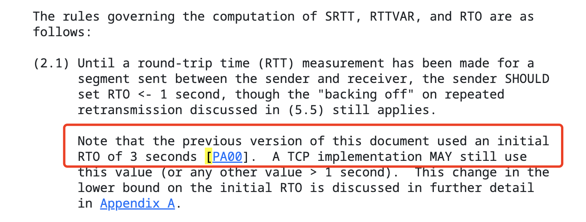

> 本文首发于公众号：腐烂的橘子

## 三次握手的流程

**第 1 步 - 初始连接请求 SYN（Synchronize）**

- 服务端状态 LISTEN，客户端向服务端发送一个 SYN 标志位的报文段（TCP segment）
- 这个报文段包含初始序列号 x，以及最大报文段大小等字段
- 客户端发送报文后，状态设置为 SYN_SEND

**第 2 步 - 服务端回复 SYN—ACK（Synchronize-Acknowledge）**

- 服务端收到 SYN 报文段后，为建立连接分配必要的资源并生成自己的 SYN 初始序列号
- 服务端发送带有 SYN 和 ACK 的报文段回复给客户端，状态置为 SYN_RCVD
- 这个报文段有两个序列号，一个是服务器自己生成的初始序列号，另一个是回复序列号，回复序列号用来回复第 1 步客户端发送来的序列号，值是 x + 1

**第 3 步 - 客户端回复 ACK（Acknowledge）**

- 客户端接收到 SYN-ACK 报文段后，回复 ACK 报文段
- ACK 报文段设置了 ACK 报文段且确认了 SYN 序列号，状态进入 ESTABLISHED，服务端收到 ACK 报文段后状态进入 ESTABLISHED
- 至此，客户端和服务端都交换了各自的 SYN 序列号建立了连接
- 现在他们可以使用确认的序列号传输数据了

## SYN 标志位、ACK 标志位、序列号到底是什么？——TCP 报文段结构

简单了解 TCP 连接之后，我们不免想知道这些标志位是什么，TCP 报文段结构就是使用 TCP 发送数据时报文段时，这个报文段具体的样子。结构如下[1]：


(图片来源于：https://www.geeksforgeeks.org/services-and-segment-structure-in-tcp/)

TCP 报文首部（header）大小是 20-60 字节（bytes）。40 字节是可选的，所以典型的 TCP 报文首部大小为 20 字节。

这里需要说明一个基本知识：1字节 = 8比特，即 1bytes = 8bits。所以图中上面浅绿色部分共 20 字节，160 比特；下面深绿色部分共 40 字节，320比特。

- 源端口号（Source Port Address）：16 比特
- 目标端口号（Destination Port Address）：16 比特
- 序列号（Sequence Number）：32 比特
- 确认应答号（Acknowledgement Number）：32 比特
- 头部长度（HLEN，Header Length）：4 比特
- 保留字段（Reserved）：6 比特，当前没有用，如果要新增标志位，可以使用这个保留区域
- 6 个标志位，每个 1 比特，值为 0 或 1：
    - URG：用来指示报文段里存在被上层发送段置为“紧急”的数据，实际上，URG 和 PSH 都没有用到
    - ACK：如果值为 1，代表这个报文段里包含一个确认信息，该信息确认了一个已接收的报文段
    - PSH：和 USG 一样，目前没用到，也是一个紧急数据的指针
    - SYN：序列号标志位，建立连接、传输数据时会用到
    - FIN：终止连接的标志位，用于在断开连接时使用
- 接收窗口大小（Window Size）：16 比特，用于流量控制，用于表示接收方愿意接受的字节数量
- 校验和（CheckSum）：16 比特，该字段保存错误控制的校验和。与 UDP 不同，它在 TCP 中是强制性的
- 紧急指针（Urgent Pointer）：16 比特，该字段仅当 URG 控制标志置位时才有效，用于指向迫切需要的、需要最早到达接收进程的数据。该字段的值与序列号相加即可得到最后一个紧急字节号

以上一共 160 比特，共 20 字节，加上可选的 40 字节，所以一个 TCP 报文的大小处于 20～60 字节。

## 为什么是三次握手不是两次？

第三次握手是客户端发送确认消息给服务端，主要原因是为了通知服务端，服务端发送的初始序列号已被客户端确认。

## 不同握手阶段的报文丢失，会发生什么

因为一共有三个阶段，如果每个阶段都发生丢包，有以下三种情况：

1. 第一次握手，客户端发送的请求包没有到达服务端
2. 第二次握手，服务端回复的 SYN+ACK 包没有到达客户端
3. 第三次握手，客户端发送的 ACK 包没有到达服务端

TCP 在丢包后都会触发重传，重传有超时重传、快速重传等很多类型，我们会在后面的文章中详细描述。这里触发的重传，都是使用最基本的“超时重传”的机制。所以上面的三种情况都会触发超时重传，区别只是客户端还是服务端来重传、和重传什么内容。

### 第一次握手失败，会发生什么？

第一次握手是客户端将 SYN 包发送到服务端，客户端状态变为 SYN_SEND。如果此阶段丢包，服务端没有收到来自客户端的 SYN 包，一直处于 LISTEN 状态。客户端这边则会触发超时重传机制，在发送 SYN 包的 x 秒后，重新发送一次 SYN 包。

**超时时间 x 的值是多少？**

其中，x 是超时时间，这个时间是由操作系统内核代码 `/include/net/tcp.h` 中的 `TCP_TIMEOUT_INIT` 字段定义的[2]，例如 linux v4.14.12 中的定义如下：

```
#define TCP_TIMEOUT_INIT ((unsigned)(1*HZ))	/* RFC6298 2.1 initial RTO value	*/
```

这里的超时时间是 `1*HZ`，取决于 TCP/IP 规范文档 RFC6298 2.1 中的初始 RTO （RTO，Retransmission Time Out，超时重传时间）时间，RFC6298 2.1 中的描述如下[3]：



“Note that the previous version of this document used an initial RTO of 3 seconds [PA00]. ”这句话表明 RTO
 的初始值是 3 秒，所以超时时间是 3 秒，在发送 SYN 包的 3 秒后，会重新发送一次 SYN 包。

**我们知道了超时时间是 3 秒后会再次发送 SYN 包，假如这个包再次超时，时间也是 3 秒吗？一共要重传多少次呢？**

我们先来看重传次数，重传次数可以在 linus 系统中使用命令查看：

```bash
sysctl net.ipv4
```

输入命令后会展示很多系统配置，从中我们可以看到两个关于 SYN 的配置：

```
net.ipv4.tcp_syn_retries = 6
net.ipv4.tcp_synack_retries = 5
```

其中 `net.ipv4.tcp_syn_retries = 6` 就是我们想要的超时重传次数，这时超时重传 6 次后会停止重试，重试 6 次后如果还是没有收到服务端发送的 ACK，客户端就会停止请求连接。

假如这个包再次超时，时间也是 3 秒吗？这个时间是不固定的，因为这个超时时间是基于 RTO 来计算的，RTO 的计算方式在 RFC6298 文档（或其他版本文档）中有定义，可以自行研究一下。总体来说，RTO 的时间会逐渐变长。

### 第二次握手失败，会发生什么？

第二次握手时，服务端会返回 ACK+SYN 报文。如果报文丢失，意味着客户端的请求没有被确认，且服务端的序列号也没有发送到客户端。因此会有如下结果：

1. 客户端由于没有收到第一次握手的 ACK 报文，所以客户端会重传 SYN 报文
2. 服务端由于没有收到客户端第三次握手的 ACK 报文，所以会重传 SYN+ACK 报文。

在前面我们知道 `net.ipv4.tcp_syn_retries = 6` 代表 SYN 会重传 6 次，即第一次握手会重试 6 次，`net.ipv4.tcp_synack_retries = 5` 就代表第二次握手的 `SYN+ACK` 报文会重试 5 次，即第二次握手会重试 5 次。

### 第三次握手失败，会发生什么？

第三次握手是客户端发送 ACK 报文给服务端，目的是让服务端知道，客户端已经确认了服务端的初始序列号。如果第三次握手失败，则服务端收不到确认，所以还是会重传 ACK + SYN 报文，根据 `net.ipv4.tcp_synack_retries = 5`，仍然会重试 5 次。

## 总结

知其然还要知其所以然，无论第几次握手失败，本质上还是利用了超时重传的机制。如果不了解 SYN、ACK 和序列号的关系，那就说明不了解 TCP 报文段的格式。其实重传机制、RTO、RTT 等等这些概念都需要我们一步步了解之后才能更深入理解三次握手，以及网络中的其他流程机制。

## 参考

1. https://www.geeksforgeeks.org/services-and-segment-structure-in-tcp/
2. https://elixir.free-electrons.com/linux/v4.14.12/source/include/net/tcp.h
3. https://datatracker.ietf.org/doc/html/rfc6298
